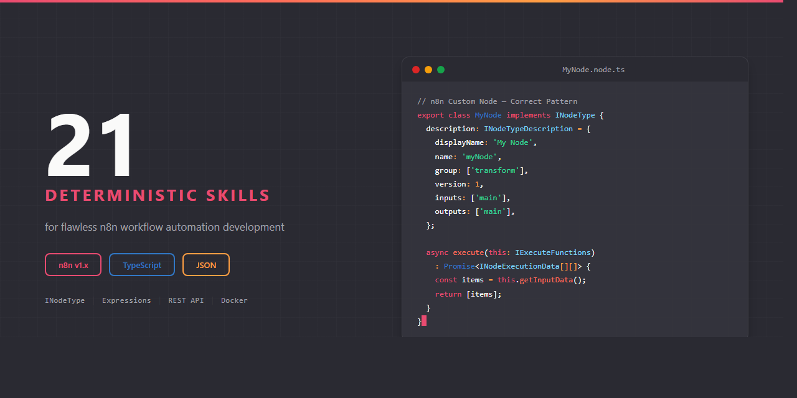

# n8n Claude Skill Package

<p align="center">
  
</p>


**21 deterministic Claude AI skills for n8n v1.x workflow automation — node-based editor for integrating APIs, services, and data.**

Built on the [Agent Skills](https://agentskills.org) open standard.

---

## Why This Exists

Without skills, Claude generates incorrect n8n patterns:

```typescript
// Wrong — incomplete INodeType, missing required properties
export class MyNode {
  execute() {
    return [{ json: { result: 'data' } }];
  }
}
```

With this skill package, Claude produces correct n8n code:

```typescript
// Correct — complete INodeType with description, properties, and proper return type
export class MyNode implements INodeType {
  description: INodeTypeDescription = {
    displayName: 'My Node',
    name: 'myNode',
    group: ['transform'],
    version: 1,
    description: 'Description of the node',
    defaults: { name: 'My Node' },
    inputs: ['main'],
    outputs: ['main'],
    properties: [],
  };

  async execute(this: IExecuteFunctions): Promise<INodeExecutionData[][]> {
    const items = this.getInputData();
    const returnData: INodeExecutionData[] = [];
    for (let i = 0; i < items.length; i++) {
      returnData.push({ json: { result: 'data' } });
    }
    return [returnData];
  }
}
```

---

## Skills (21)

### Core (2 skills)

| Skill | What It Covers |
|-------|---------------|
| [n8n-core-architecture](skills/source/n8n-core/n8n-core-architecture/SKILL.md) | Execution model, item-based data flow, binary data, paired items, process modes |
| [n8n-core-api](skills/source/n8n-core/n8n-core-api/SKILL.md) | REST API endpoints, authentication, pagination, workflow/execution management |

### Syntax (8 skills)

| Skill | What It Covers |
|-------|---------------|
| [n8n-syntax-workflow-json](skills/source/n8n-syntax/n8n-syntax-workflow-json/SKILL.md) | Workflow JSON structure, IConnections 3-level nesting, 13 connection types |
| [n8n-syntax-expressions](skills/source/n8n-syntax/n8n-syntax-expressions/SKILL.md) | All `$` variables, JMESPath, paired items, static data, utility functions |
| [n8n-syntax-extension-methods](skills/source/n8n-syntax/n8n-syntax-extension-methods/SKILL.md) | 80+ methods: string, array, number, object, boolean, DateTime/Luxon |
| [n8n-syntax-node-types](skills/source/n8n-syntax/n8n-syntax-node-types/SKILL.md) | INodeType, INodeProperties (22 types), displayOptions, execute(), declarative |
| [n8n-syntax-credentials](skills/source/n8n-syntax/n8n-syntax-credentials/SKILL.md) | ICredentialType, 4 auth injection methods, OAuth2, credential testing |
| [n8n-syntax-code-node](skills/source/n8n-syntax/n8n-syntax-code-node/SKILL.md) | Code node JS/Python, execution modes, restrictions, binary data |
| [n8n-syntax-trigger-nodes](skills/source/n8n-syntax/n8n-syntax-trigger-nodes/SKILL.md) | Event/polling/webhook triggers, ITriggerFunctions, webhook lifecycle |
| [n8n-syntax-ai-nodes](skills/source/n8n-syntax/n8n-syntax-ai-nodes/SKILL.md) | AI/LLM cluster nodes, agents, memory, vector stores, RAG patterns |

### Implementation (6 skills)

| Skill | What It Covers |
|-------|---------------|
| [n8n-impl-custom-nodes](skills/source/n8n-impl/n8n-impl-custom-nodes/SKILL.md) | Custom node development, n8n-nodes-starter, packaging, npm publishing |
| [n8n-impl-deployment](skills/source/n8n-impl/n8n-impl-deployment/SKILL.md) | Docker Compose, 100+ env vars, queue mode, Redis, CLI, backup |
| [n8n-impl-workflow-design](skills/source/n8n-impl/n8n-impl-workflow-design/SKILL.md) | Sub-workflows, error workflows, branching, merge/loop, scheduling |
| [n8n-impl-integrations](skills/source/n8n-impl/n8n-impl-integrations/SKILL.md) | HTTP Request node, OAuth2 flows, pagination, generic credentials |
| [n8n-impl-webhooks](skills/source/n8n-impl/n8n-impl-webhooks/SKILL.md) | Webhook node, test vs production URLs, response modes, authentication |
| [n8n-impl-security](skills/source/n8n-impl/n8n-impl-security/SKILL.md) | Encryption, Docker Secrets, task runners, CORS, reverse proxy, audit |

### Error Handling (3 skills)

| Skill | What It Covers |
|-------|---------------|
| [n8n-errors-execution](skills/source/n8n-errors/n8n-errors-execution/SKILL.md) | Execution failures, continueOnFail, retry, error workflows |
| [n8n-errors-expressions](skills/source/n8n-errors/n8n-errors-expressions/SKILL.md) | Expression errors, undefined refs, type mismatches, context restrictions |
| [n8n-errors-connection](skills/source/n8n-errors/n8n-errors-connection/SKILL.md) | API failures, credential errors, timeouts, SSL, webhook URLs |

### Agents (2 skills)

| Skill | What It Covers |
|-------|---------------|
| [n8n-agents-review](skills/source/n8n-agents/n8n-agents-review/SKILL.md) | Validation checklist: JSON, connections, expressions, credentials, deployment |
| [n8n-agents-project-scaffolder](skills/source/n8n-agents/n8n-agents-project-scaffolder/SKILL.md) | Generate Docker Compose, custom nodes, workflow templates, env files |

---

## Installation

### Claude Code

```bash
# Option 1: Clone the full package
git clone https://github.com/OpenAEC-Foundation/n8n-Claude-Skill-Package.git
cp -r n8n-Claude-Skill-Package/skills/source/ ~/.claude/skills/n8n/

# Option 2: Add as git submodule
git submodule add https://github.com/OpenAEC-Foundation/n8n-Claude-Skill-Package.git .claude/skills/n8n
```

### Claude.ai (Web)

Upload individual SKILL.md files as project knowledge.

---

## Methodology

Built using the **7-phase research-first methodology**, proven across:
- [ERPNext Skill Package](https://github.com/OpenAEC-Foundation/ERPNext_Anthropic_Claude_Development_Skill_Package) (28 skills)
- [Blender-Bonsai Skill Package](https://github.com/OpenAEC-Foundation/Blender-Bonsai-ifcOpenshell-Sverchok-Claude-Skill-Package) (73 skills)
- [Tauri 2 Skill Package](https://github.com/OpenAEC-Foundation/Tauri-2-Claude-Skill-Package) (27 skills)

All code verified against [official n8n documentation](https://docs.n8n.io/) and [n8n source code](https://github.com/n8n-io/n8n). No hallucinated APIs.

## Documentation

| Document | Purpose |
|----------|---------|
| [INDEX.md](INDEX.md) | Complete skill catalog with descriptions |
| [ROADMAP.md](ROADMAP.md) | Project status (single source of truth) |
| [REQUIREMENTS.md](REQUIREMENTS.md) | Quality guarantees |
| [DECISIONS.md](DECISIONS.md) | Architectural decisions |
| [SOURCES.md](SOURCES.md) | Official reference URLs |
| [WAY_OF_WORK.md](WAY_OF_WORK.md) | Development methodology |

## License

[MIT](LICENSE)

---

Part of the [OpenAEC Foundation](https://github.com/OpenAEC-Foundation) ecosystem.
